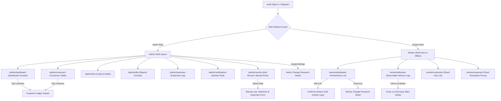

# 💧 Shifaf Aab (شِفَاء آب) — Complete Application Manual & System Architecture

This manual details the entire business logic, screen flow, database schema, realtime notifications, navigation linking, and the recent feature additions and critical bug fixes implemented in **Shifaf Aab**.

---

## 📌 1. Product Overview & Core Roles

Shifaf Aab is a mobile-first, production-ready web application designed for pure water bottle delivery and business management. It covers inventory loading, sales logging, expense capture, customer ledger balancing, dynamic reports, and push notifications.

### 👑 A. Admin Role
- **Focus**: Business oversight, financial auditing, customer relations, statements, and manual entries.
- **Access**: High-fidelity desktop dashboard console featuring performance charts, calendar lot audits, customer profile management, payment logging, custom range statements, and detailed PDF report downloads.
- **Pathways**: `/admin/dashboard`, `/admin/customers`, `/admin/lots`, `/admin/bills`, `/admin/expenses`, `/admin/notifications`, and `/admin/records` (Manual Entries).

### 🚚 B. Worker Role
- **Focus**: Field operations, loading water lots, logging deliveries, and reporting expenses.
- **Access**: Mobile-optimized viewport with step-by-step active lot actions, manual lot closing, delivery logs with searchable customers, and individual activity feed.
- **Pathways**: `/worker/dashboard`, `/worker/deliveries`, `/worker/customers`, and `/worker/expenses`.

---

## 🎨 2. Design System & Style Guide

- **Color Palette**:
  - **Primary Brand Blue**: `#0077B6` (headers, primary action buttons, active status badges).
  - **Secondary Cyan**: `#00B4D8` (active toggles, today's operation charts).
  - **Accent Ice Blue**: `#90E0EF` (hover states, dividers, subtext highlights).
  - **Success Green**: `#2EC4B6` (paid/overpaid statuses, profit metrics).
  - **Destructive Red**: `#E63946` (expenses, negative revenue indicators, log-out actions).
  - **Muted Subtext**: `#64748B` (helper text, empty states).
- **Layout Constraints**:
  - **Worker Viewport**: Bound to exactly `max-w-[390px]` representing standard mobile screen viewports.
  - **Admin Viewport**: Responsive desktop screen format containing a left sidebar navigation panel (width `w-60` or `240px`) that adapts into a sleek bottom sticky navigation bar on mobile screen layouts.
- **Visual Styles**:
  - `card-surface`: White card layout with `12px` border-radius (`rounded-[12px]`), `1px` border (`border-[#E2E8F0]`), and subtle shadow.
  - Form Fields: Height `44px`, padding `14px`, border `1px` solid border color, background colors, and rounded `10px`.

---

## 🔄 3. Complete Navigation & Screen Connectivity

The user navigation tree, role-based route guards, and drawer flows are structured as follows:



---

## 🗄️ 4. Database Schema (Supabase Tables)

### A. Table: `profiles`
Represents users and authentication roles.
- `id` (UUID, Primary Key)
- `name` (TEXT)
- `phone` (TEXT, NULL)
- `push_subscription` (JSONB, NULL)
- `created_at` (TIMESTAMPTZ)

### B. Table: `user_roles`
Determines access privileges.
- `id` (UUID, Primary Key)
- `user_id` (UUID, Foreign Key to `profiles.id`)
- `role` (TEXT: `'admin' | 'worker'`)

### C. Table: `customers`
- `id` (UUID, Primary Key)
- `name` (TEXT)
- `phone` (TEXT, NULL)
- `address` (TEXT)
- `price_per_bottle` (NUMERIC)
- `route` (TEXT: `'A' | 'B'`)
- `empty_bottles` (INTEGER, DEFAULT 0)  -- NEWLY ADDED
- `created_at` (TIMESTAMPTZ)

### D. Table: `lots`
Represents water inventory loads taken out by workers.
- `id` (UUID, Primary Key)
- `worker_id` (UUID, Foreign Key to `profiles.id`)
- `total_bottles` (INTEGER)
- `status` (TEXT: `'active' | 'completed'`)
- `created_at` (TIMESTAMPTZ)
- `completed_at` (TIMESTAMPTZ, NULL)

### E. Table: `deliveries`
Logged transactions of loaded bottles.
- `id` (UUID, Primary Key)
- `lot_id` (UUID, Foreign Key to `lots.id`)
- `worker_id` (UUID, Foreign Key to `profiles.id`)
- `customer_id` (UUID, NULL, Foreign Key to `customers.id`)
- `customer_type` (TEXT: `'walk_in' | 'regular'`)
- `bottles_delivered` (INTEGER)
- `price_per_bottle` (NUMERIC)
- `total_amount` (NUMERIC)
- `payment_mode` (TEXT: `'cash' | 'card' | 'online' | 'pending'`)
- `created_at` (TIMESTAMPTZ)

### F. Table: `payments`
Balance dues collections.
- `id` (UUID, Primary Key)
- `customer_id` (UUID, Foreign Key to `customers.id`)
- `amount` (NUMERIC)
- `payment_mode` (TEXT: `'cash' | 'card' | 'online'`)
- `recorded_by` (UUID, Foreign Key to `profiles.id`)
- `created_at` (TIMESTAMPTZ)

### G. Table: `expenses`
Operating costs logged.
- `id` (UUID, Primary Key)
- `worker_id` (UUID, Foreign Key to `profiles.id`)
- `name` (TEXT)
- `amount` (NUMERIC)
- `created_at` (TIMESTAMPTZ)

### H. Table: `notifications`
Real-time operations log.
- `id` (UUID, Primary Key)
- `user_id` (UUID, NULL, Foreign Key to `profiles.id`)
- `worker_id` (UUID, NULL, Foreign Key to `profiles.id`)
- `kind` (TEXT)
- `message` (TEXT)
- `is_read` (BOOLEAN, DEFAULT false)
- `created_at` (TIMESTAMPTZ)

---

## 🛠️ 5. Implementation Workings & Linking

### 1. Lot Creation Notification Flow
* **Trigger**: A worker logs into the mobile app and starts a new lot by inputting the number of loaded bottles.
* **Database Insert**: Row is added to `lots` table.
* **Notification Flow**:
  1. System writes `console.log("LOT CREATED - starting notification flow")`.
  2. System inserts a row into `notifications` table containing details of the lot:
     ```javascript
     const { error: notifError } = await supabase
       .from('notifications')
       .insert({
         message: `Worker started a new lot of ${totalBottles} bottles`,
         worker_id: currentUser.id,
         is_read: false,
         created_at: new Date().toISOString(),
         kind: 'lot'
       });
     ```
  3. System calls `broadcastPushToAdmins` helper which imports `@/lib/push-server` and dispatches browser push notifications using VAPID keys and standard web push server events.
* **Realtime Listener**: On the admin side:
  - Both [admin-shell.tsx](file:///c:/Users/ahmad/Downloads/waterflow-manage-main/waterflow-manage-main/src/components/admin-shell.tsx) and [_authenticated.admin.notifications.tsx](file:///c:/Users/ahmad/Downloads/waterflow-manage-main/waterflow-manage-main/src/routes/_authenticated.admin.notifications.tsx) open realtime Postgres websocket channels on the database table `notifications`.
  - The channels listen to `INSERT` postgres events in realtime. When detected, they dynamically append the new notification object directly to the local React query state and invalidate cache queries so that the unread notifications count incrementing is instantly visible without forcing page reload.

### 2. Customer Empty Bottles Tracking
* **A. Database & Typing System**:
  - The `customers` table contains `empty_bottles` (defaults to `0`).
  - Added type parameters inside `types.ts` so compilers and client scripts recognize `empty_bottles` safely.
* **B. Admin Dashboard Interface**:
  - **Form Drawers**: When adding or editing customers via the Drawer overlay, an "Empty Bottles at Customer" input appears right after the "Delivery Route" selector.
  - **Validations**: Form validates inputs inline. Fields must not be empty or negative numbers. Upon submission, it maps `empty_bottles` and performs updating on Supabase.
  - **Stat Badge**: Admin customer view lists `🫙 X empty bottles` in `#64748B` color and `text-sm` size right below route badges.
  - **Ledger Header**: Displays a neat chip layout `Empty Bottles: X` in the header panel of the Ledger drawer.
* **C. Worker Interface**:
  - Worker accesses customers list to view balances and ledger history. Tapping on a customer displays a ledger history slide-out drawer containing a read-only `Empty Bottles: X` badge.

### 3. Manual Record Entry Screen (Admin Only)
* **Accessibility**: Handled under route `/admin/records`, linked inside the Left Desktop Sidebar and the Mobile Bottom Navigation Bar (represented by a Clipboard icon).
* **Form Workings**:
  1. **Select Date**: Simple date picker restricting inputs to yesterday or older (today and future dates disabled). Rest of the form remains hidden until date is chosen.
  2. **Add Lot Blocks**: Interactive block containers allowing admins to declare loaded lots.
  3. **Add Deliveries**: Interactive sub-blocks within lots. Support Walk-in or Regular Customer toggle. If Walk-in, price defaults to `Rs. 25`. If Regular, includes a live searchable customer dropdown. Quantity, custom prices, auto-calculated total amount, and payment mode selector (Cash, Card, Online, Pending - Pending only if Regular Customer) are rendered.
  4. **Add Expenses**: Row-by-row expense entries select through 5 default business categories and input pricing.
  5. **Submit Transaction**:
     - Loops sequentially through lots and inserts them to obtain `lot_id` responses.
     - Maps deliveries under the corresponding `lot_id` and saves them to the database.
     - Adds expenses to the `expenses` table.
     - Broadcasts a single action notification: `Admin manually added records for [DD MMM YYYY]` and displays a success toast.
     - Resets state and routes the administrator back to the dashboard where KPIs and charts update dynamically because they query records filtered by date.
