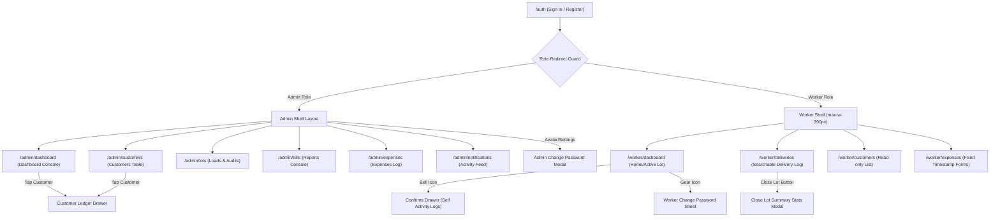

# 💧 Shifaf Aab — Master Application Documentation

Welcome to the comprehensive master documentation for **Shifaf Aab** (شِفَاء آب) — a mobile-first, production-ready web application designed for pure water bottle delivery and business management. This document outlines the product architecture, visual identity, tech stack, screen flows, database models, and all feature implementations including the final targeted fixes.

---

## 📌 1. Product Overview & Core Roles

Shifaf Aab simplifies day-to-day operations for pure water delivery enterprises. It covers loading inventory, logging sales, capturing operational expenses, managing customer ledger balances, generating dynamic statement presets, and dispatching real-time notifications. The application supports two distinct roles:

### 👑 A. Admin Role
- **Focus**: Business oversight, financial auditing, customer relations, statement reporting, and password configuration.
- **Access**: High-fidelity desktop dashboard console featuring performance charts, calendar lot audits, customer profile management, payment logging, custom range statement compilation, and detailed PDF report downloads.

### 🚚 B. Worker Role
- **Focus**: Mobile-first field execution, loading water lots, logging deliveries, and reporting operational expenses.
- **Access**: Mobile-optimized shell with step-by-step active lot actions, manual lot closing with summary statistics sheets, delivery logs with searchable customers, individual activity drawers (bell feed), and quick password settings.

---

## 🎨 2. Design System & Constraints

The application adheres to the core brand identity of Shifaf Aab:

- **Color Palette**:
  - **Primary Brand Blue**: `#0077B6` (used for headers, primary action buttons, active status badges, and brand highlights).
  - **Secondary Cyan**: `#00B4D8` (active toggles, today's operation charts, highlight metrics).
  - **Accent Ice Blue**: `#90E0EF` (hover states, drawer dividers, subtext highlights).
  - **Success Green**: `#2EC4B6` (used for paid/overpaid statuses and profit metrics).
  - **Destructive Red**: `#E63946` (expenses, negative revenue indicators, and log-out actions).
- **Layout Ergonomics**:
  - **Worker Viewport**: Bound to exactly `max-w-[390px]` representing standard mobile screen viewports.
  - **Admin Viewport**: Responsive desktop screen format containing a left sidebar navigation panel (width `w-60` or `240px`) that adapts into a sleek bottom sticky navigation bar on mobile screen layouts.

---

## ⚙️ 3. Technical Stack

- **Frontend Core**: **Vite & React** structured via Next.js routing patterns.
- **Routing Engine**: **TanStack Router** with static file-based routing guards.
- **State Queries**: **TanStack React Query** for automatic caching and invalidations.
- **Database & Realtime**: **Supabase** (Auth, PostgREST API client, and Realtime notification channels).
- **Service Worker / PWA**: Native PWA structure using browser `PushManager` and custom `sw.js` handlers.
- **PDF Compiler**: Client-side compiled statements using `jspdf` and `jspdf-autotable`.

---

## 🔄 4. Navigation & Screen Connectivity Flow

Below is the complete user navigation tree, including redirection guards, sliding drawers, and sheets:

---

## 🛠️ 5. Detailed Features & Targeted Fixes

### 🔒 A. Role-Based Route Protection (`_authenticated.tsx`)
- Validates user roles immediately on authentication state updates.
- Workers visiting `/admin/*` are automatically redirected back to `/worker/dashboard`.
- Admins visiting `/worker/*` are automatically redirected back to `/admin/dashboard`.
- Employs a visual loading pulse container during transition states.

---

### 🚚 B. Worker Features

#### 1. Home Dashboard (`/worker/dashboard`)
- **Active Lot Card**: Visual overview of currently loaded water stock. Status indicators are colored in brand blue (`#0077B6`).
- **Realtime Notifications Bell**: Launches the sliding drawer of confirmation activity logs. Feeds are strictly filtered by the current worker's ID (`worker_id = user.id`) so workers only view their own activities.
- **Change Password**: Gear icon next to the bell launches the password update sheet connected to `supabase.auth.updateUser`.

#### 2. Log Delivery Screen (`/worker/deliveries`)
- **Active Lot Fallback**: If the URL `lotId` parameter is missing (e.g., when navigates directly via the bottom nav), the page automatically queries Supabase for the worker's most recent active lot (`status = 'active'`).
- **Fallback Empty State**: If no active lot exists, the page renders an outline `Truck` icon in `#90E0EF` (48px) with the message `"No active lot. Go to Home to start a new lot."` and a `"Go to Home"` primary button routing back to the home screen.
- **Searchable Customer Dropdown**: Live dropdown field filtering through regular customers.
- **Direct Numeric Input**: Direct keyboard input box for quantity values.
- **Payment Toggles**: Cash, Card, Online, and Pending selector buttons.
- **Inline Validation**: Displays clear red alerts beneath input fields for missing or invalid values.
- **Manual Lot Closing**: Replaced automatic closures with a manual "Close Lot" action. Tapping it triggers a `CloseLotSheet` displaying summary lot statistics:
  - *Went out*: Total loaded bottles.
  - *Delivered*: Bottles logged.
  - *Remaining*: Remaining bottles in stock.
  - *Revenue Collected*: Sum of cash/card/online deliveries.
  - *Pending Collection*: Sum of pending deliveries.

#### 3. Worker Expenses (`/worker/expenses`)
- **Disabled Timestamps**: Locked to current local time values.
- **Validation alerts**: Shows inline red errors for empty fields.

---

### 👑 C. Admin Features

#### 1. Console Shell & Navigation (`admin-shell.tsx`)
- **Mobile Nav Consolidation**: Combined previous mobile navigation tabs into a single **"Reports"** tab routing to `/admin/bills`.
- **Mobile Profile Tab**: Added a dedicated bottom tab opening a drawer with initials avatar, user name, user email, a change password trigger, and a logout button.
- **Desktop Sidebar Footer**: Pinned profile stats (initials circle, name, email) and buttons for changing passwords and logging out directly to the bottom.

#### 2. Dashboard Console (`/admin/dashboard`)
- **KPI Summary Cards (Standardized revenue formulas)**:
  - *Total Revenue*: Walks-in sales plus all customer payments.
    - `Walk-in Revenue = SUM(deliveries where customer_type = 'walkin' AND payment_mode != 'pending')`
    - `Regular Customer Collected Revenue = SUM(payments)` (never add regular customer non-pending deliveries to revenue)
    - `Total Revenue = Walk-in Revenue + Regular Customer Collected Revenue`
  - *Total Expenses*: Sum of logged expense costs.
  - *Net Revenue*: Calculated as `Total Revenue - Total Expenses` (displays in red if negative).
- **Inline Collection Chips**: Displays inline Walk-in Revenue and Pending Collection values below KPI cards.
  - `Pending Collection = SUM(deliveries where customer_type = 'regular' AND payment_mode = 'pending') - SUM(payments)`
- **Visual Performance Chart**: Weekly bar chart illustrating sales or revenue history. Daily sales aggregation sums daily walk-in non-pending deliveries and payments.
- **Daily Operations details drawer**: Tapping any bar displays that day's loaded lots, deliveries log (with customer types and payment modes), expenses, and recorded payments.
- **Customer Summary Table**: Lists customer statuses and dues. Dues are computed using the Balance Due formula (`Pending - Payments`). Dues display green `"Cleared"` chip if exactly zero, green `"Overpaid"` chip if negative (never showing negative sign or Rs. symbol), and amber `"Rs. X,XXX"` chip only when balance is positive. Tapping a row launches the ledger drawer.

#### 3. Bills & Reports Console (`/admin/bills`)
- **Date Filtering**: Allows choosing custom from/to ranges and customer filters.
- **Custom Range statements**: Allows custom dates and customer filters to download structured statements as clean PDFs.
- **Monthly Reports (Dynamic Year Dropdown)**: 
  - Flat list of months replaced with a styled `"Select Year"` dropdown selector.
  - Options are dynamically compiled from the earliest recorded delivery up to the current year.
  - Months grid displays only months that have delivery data recorded for the selected year.
  - Month cards layout wraps in a responsive grid layout (1 column on mobile, 3 columns on desktop).
- **Daily Operations Reports**: A date picker to select a date and download a single-day PDF operations report.

#### 4. Active & Past Lots (`/admin/lots`)
- A grid showing all active and past loads with date picker controls to view loads matching specific calendar dates.

#### 5. Customer Ledger drawers (`/admin/customers`)
- Displays detailed profile cards including addresses.
- Ledgers split into two functional tabs: **Deliveries** (history of logs) and **Payments** (logged payments).
- Form fields in the add customer drawer leverage inline red text validations.

---

### 📊 D. PDF Statement Separations (`pdf-generator.ts`)
- **Walk-in separating**: Separates walk-in customer sales from regular customer collected and pending revenue.
- **Ledger summaries**: Appends a per-customer ledger summary table detailing bottles delivered, pending billed, payments received, and closing balances inside monthly and custom range statement files.

---

### 📭 E. Standardized Empty States
Implemented across the entire codebase to replace raw card surfaces when no records are available. Uses a centered outline icon (color `#90E0EF`, 48px) and helper texts (`#64748B`):
- **Worker Customers**: `"No customers added yet"` (with `Users` icon).
- **Worker Expenses**: `"No expenses logged today"` (with `Receipt` icon).
- **Worker Activity Drawer**: `"No activity yet"` (with `Bell` icon).
- **Worker Today's Lots**: `"No lots started today. Tap 'Start New Lot' to begin."` (with `Truck` icon).
- **Admin Customers**: `"No customers found"` (with `Users` icon).
- **Admin Lots**: `"No lots found for this date"` (with `PackageOpen` icon).
- **Admin Expenses**: `"No expenses logged for this period"` (with `Receipt` icon).
- **Admin Notifications**: `"No notifications yet"` (with `Bell` icon).
- **Customer Ledger Deliveries**: `"No deliveries recorded yet"` (with `Truck` icon).
- **Customer Ledger Payments**: `"No payments recorded yet"` (with `CreditCard` icon).
- **Dashboard Recent Deliveries Feed**: `"No deliveries today"` (with `Truck` icon).
- **Dashboard Recent Expenses Feed**: `"No expenses today"` (with `Receipt` icon).
- **Dashboard Customers Summary Table**: `"No regular customers yet"` (with `Users` icon).

---

## 🔔 6. Web Push Notifications (PWA)

- **Service Worker (`public/sw.js`)**: Implements event listeners to capture push payloads, trigger notification popups, and focus/navigate the browser window to targeted links when the banner is tapped.
- **Client Subscription (`push-notifications.ts`)**: Requests user permission on login, subscribes the browser endpoint using VAPID keys, and stores the details inside the user's `profiles.push_subscription` JSONB field.
- **Server Functions (`push-server.ts`)**: Uses standard web-push utilities to dispatch notifications.
  - Workers starting a new lot, logging a delivery, or adding an expense triggers a real-time push to all admins.
  - Admins logging payments triggers notifications.

---

## 🗄️ 7. Database Model (Supabase SQL Schema)

The database schema is organized into 8 primary tables:

1. **`profiles`**: User details (Linked to `auth.users`).
2. **`user_roles`**: Maps user IDs to `'admin'` or `'worker'` role enums.
3. **`customers`**: Stores regular customer names, base price per bottle, address, and contact numbers.
4. **`lots`**: Tracks loaded stocks, completion dates, and status (`'active'`, `'completed'`).
5. **`deliveries`**: Delivery rows containing quantity, unit price, payment mode (`'cash'`, `'card'`, `'online'`, `'pending'`), customer type (`'walkin'`, `'regular'`), and target customer relations.
6. **`payments`**: Records payments collected against customer ledgers.
7. **`expenses`**: Logs business purchases, costs, and the logger.
8. **`notifications`**: Activity feed alerts (includes a `worker_id` uuid column to filter worker feeds).
