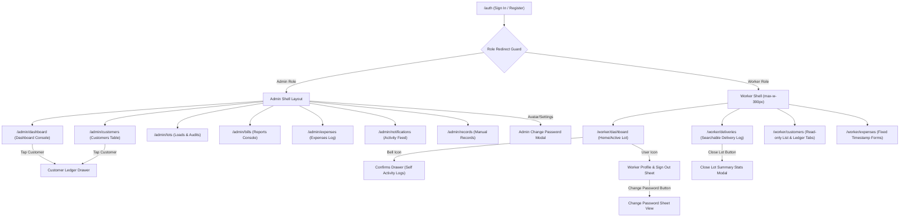

# 💧 Shifaf Aab — Master Application Documentation

Welcome to the comprehensive master documentation for **Shifaf Aab** (شِفَاء آب) — a mobile-first, production-ready web application designed for pure water bottle delivery and business management. This document outlines the product architecture, visual identity, tech stack, screen flows, database models, RLS policies, revenue formulas, realtime/push communication, and all recently completed fixes.

---

## 📌 1. Product Overview & Core Roles

Shifaf Aab simplifies day-to-day operations for pure water delivery enterprises. It covers loading inventory, logging sales, capturing operational expenses, managing customer ledger balances, generating statement presets, and dispatching real-time notifications. The application supports two distinct roles:

### 👑 A. Admin Role
- **Focus**: Business oversight, financial auditing, customer relations, statement reporting, and password configuration.
- **Access**: High-fidelity desktop dashboard console featuring performance charts, calendar lot audits, customer profile management, payment logging, custom range statement compilation, and detailed PDF report downloads.

### 🚚 B. Worker Role
- **Focus**: Mobile-first field execution, loading water lots, logging deliveries, and reporting operational expenses.
- **Access**: Mobile-optimized shell with step-by-step active lot actions, manual lot closing with summary statistics sheets, delivery logs with searchable customers, individual activity drawers (bell feed), and a profile bottom sheet incorporating sign out and change password.

---

## 🎨 2. Design System & Constraints

The application adheres to the core brand identity of Shifaf Aab:

- **Color Palette**:
  - **Primary Brand Blue**: `#0077B6` (used for headers, primary action buttons, active status badges, and brand highlights).
  - **Secondary Cyan**: `#00B4D8` (active toggles, today's operation charts, highlight metrics).
  - **Accent Ice Blue**: `#90E0EF` (hover states, drawer dividers, subtext highlights).
  - **Success Green**: `#2EC4B6` (used for paid/overpaid statuses and profit metrics).
  - **Destructive Red**: `#E63946` (expenses, negative revenue indicators, and sign-out buttons).
- **Layout Ergonomics**:
  - **Worker Viewport**: Bound to exactly `max-w-[390px]` representing standard mobile screen viewports.
  - **Admin Viewport**: Responsive desktop screen format containing a left sidebar navigation panel (width `w-60` or `240px`) that adapts into a sleek bottom sticky navigation bar on mobile screen layouts.

---

## ⚙️ 3. Technical Stack

- **Frontend Core**: **Vite & React 19** structured with TanStack Start (TypeScript).
- **Routing Engine**: **TanStack Router** with file-based routing and role-based auth guards.
- **State Queries**: **TanStack React Query** for automatic caching and invalidations.
- **Database & Realtime**: **Supabase** (Auth, PostgREST API client, and Realtime Postgres channels).
- **Service Worker / PWA**: Native PWA structure using browser `PushManager` and custom `sw.js` handlers.
- **PDF Compiler**: Client-side compiled statements using `jspdf` and `jspdf-autotable`.

---

## 🔄 4. Navigation & Screen Connectivity Flow

Below is the complete user navigation tree, including redirection guards, sliding drawers, and sheets:

---

## 🖥️ 5. Screen Breakdown & Functions

### 🚚 Worker Screens
1. **Home Dashboard (`/worker/dashboard`)**
   - Displays unified daily statistics: Bottles Sold, Revenue, Active Lots, and Expenses (aligned company-wide).
   - Allows starting a new delivery lot.
   - Profile/User icon opens the worker menu sheet containing session information, logout, and password change.
   - Activity bell feed shows filtered notifications for the logged-in worker.
2. **Log Delivery (`/worker/deliveries`)**
   - Automatically fallbacks to the worker's latest active lot if `lotId` is absent.
   - Searchable customer selection, direct numeric input for quantity, payment mode buttons.
   - Allows manually completing/closing the lot, opening a sheet displaying stock balance details and collection sums.
3. **Worker Customers (`/worker/customers`)**
   - Searchable customer records list with route filters.
   - Ledger Drawer displays split tabs for Customer Deliveries history and Payments logs.
   - Allows worker to log payments on customer account.
4. **Worker Expenses (`/worker/expenses`)**
   - Form to log daily expenses with fixed current local timestamp validation.

### 👑 Admin Screens
1. **Console Shell (`admin-shell.tsx`)**
   - Desktop layout features left sidebar; mobile layout collapses to bottom navigation.
   - Sidebar includes avatar indicator, profile details, password edit, and sign-out controls.
2. **Dashboard Console (`/admin/dashboard`)**
   - Standardized business KPIs: Total Bottles Sold, Total Revenue, Total Expenses, Net Revenue (green/red indicators).
   - Walk-in sales and Pending collections indicators.
   - Interactive 7-day sales breakdown chart. Clicking a day loads daily operation logs modal.
   - Customer summary list showing route filters, balance status (Cleared/Overpaid/Pending), and dues.
3. **Bills & Reports (`/admin/bills`)**
   - Range picker and customer filter controls.
   - Statement generator triggers PDF downloads.
   - Dynamic year dropdown displaying monthly stats cards for months with active records.
   - Single-day operations report picker and compiler.
4. **Loads & Audits (`/admin/lots`)**
   - Admin view of all worker lots. Searchable by date and worker.
5. **Admin Expenses (`/admin/expenses`)**
   - Ledger table of operations expenses across all workers.
6. **Manual Record Entry (`/admin/records`)**
   - Back-office manual entry interface for lots, deliveries, and payments.

---

## 🗄️ 6. Database Models (Supabase SQL Schema)

The database schema is organized into 8 primary tables:

### 1. `profiles`
Represents user records matching auth accounts.
- `id` (`UUID`, PRIMARY KEY, references `auth.users`)
- `name` (`TEXT`, NOT NULL, default `''`)
- `email` (`TEXT`)
- `created_at` (`TIMESTAMPTZ`, default `now()`)
- `push_subscription` (`JSONB`, holds subscription payload)

### 2. `user_roles`
Maps users to specific authorization roles.
- `id` (`UUID`, PRIMARY KEY, default `gen_random_uuid()`)
- `user_id` (`UUID`, references `auth.users`, unique check)
- `role` (`app_role` ENUM: `'admin'`, `'worker'`)
- `created_at` (`TIMESTAMPTZ`, default `now()`)

### 3. `customers`
Stores regular client details.
- `id` (`UUID`, PRIMARY KEY, default `gen_random_uuid()`)
- `name` (`TEXT`, NOT NULL)
- `address` (`TEXT`, NOT NULL, default `''`)
- `phone` (`TEXT`)
- `price_per_bottle` (`NUMERIC(10,2)`, default `0`)
- `route` (`TEXT` check `route IN ('A', 'B')`, default `'A'`)
- `empty_bottles` (`INTEGER`, default `0`)
- `created_at` (`TIMESTAMPTZ`, default `now()`)

### 4. `lots`
Represents loading of water inventories.
- `id` (`UUID`, PRIMARY KEY, default `gen_random_uuid()`)
- `worker_id` (`UUID`, references `auth.users`)
- `total_bottles` (`INTEGER`, check `> 0`)
- `status` (`lot_status` ENUM: `'active'`, `'completed'`, default `'active'`)
- `created_at` (`TIMESTAMPTZ`, default `now()`)
- `completed_at` (`TIMESTAMPTZ`)

### 5. `deliveries`
Logged bottles delivery records.
- `id` (`UUID`, PRIMARY KEY, default `gen_random_uuid()`)
- `lot_id` (`UUID`, references `lots`)
- `worker_id` (`UUID`, references `auth.users`)
- `customer_id` (`UUID`, references `customers`, nullable)
- `customer_type` (`customer_type` ENUM: `'walkin'`, `'regular'`)
- `bottles_delivered` (`INTEGER`, check `> 0`)
- `price_per_bottle` (`NUMERIC(10,2)`)
- `total_amount` (`NUMERIC(12,2)`)
- `payment_mode` (`payment_mode` ENUM: `'cash'`, `'card'`, `'online'`, `'pending'`)
- `created_at` (`TIMESTAMPTZ`, default `now()`)

### 6. `payments`
Recorded payments collected on account.
- `id` (`UUID`, PRIMARY KEY, default `gen_random_uuid()`)
- `customer_id` (`UUID`, references `customers`)
- `amount` (`NUMERIC(12,2)`, check `> 0`)
- `payment_mode` (`payment_mode` ENUM: `'cash'`, `'card'`, `'online'`, `'pending'`)
- `recorded_by` (`UUID`, references `auth.users`)
- `created_at` (`TIMESTAMPTZ`, default `now()`)

### 7. `expenses`
Operational expense records.
- `id` (`UUID`, PRIMARY KEY, default `gen_random_uuid()`)
- `worker_id` (`UUID`, references `auth.users`)
- `name` (`TEXT`, NOT NULL)
- `amount` (`NUMERIC(12,2)`, check `> 0`)
- `created_at` (`TIMESTAMPTZ`, default `now()`)

### 8. `notifications`
System logs and activities feed.
- `id` (`UUID`, PRIMARY KEY, default `gen_random_uuid()`)
- `user_id` (`UUID`, references `auth.users`, nullable)
- `kind` (`TEXT`)
- `message` (`TEXT`)
- `is_read` (`BOOLEAN`, default `false`)
- `created_at` (`TIMESTAMPTZ`, default `now()`)
- `worker_id` (`UUID`, references `profiles`, nullable)

---

## 🔒 7. Row-Level Security (RLS) Policies

All database tables have row-level security enabled. Active policies are:

### `profiles`
- `profiles self read`: `auth.uid() = id` (SELECT for authenticated)
- `profiles admin read`: `has_role(auth.uid(), 'admin')` (SELECT for authenticated)
- `profiles self update`: `auth.uid() = id` (UPDATE for authenticated)

### `user_roles`
- `roles self read`: `auth.uid() = user_id` (SELECT for authenticated)
- `roles admin read`: `has_role(auth.uid(), 'admin')` (SELECT for authenticated)

### `customers`
- `customers read all auth`: `true` (SELECT for authenticated)
- `customers admin write`: `has_role(auth.uid(), 'admin')` (ALL for authenticated)

### `lots`
- `lots worker own`: `worker_id = auth.uid()` (ALL for authenticated)
- `lots admin read`: `has_role(auth.uid(), 'admin')` (SELECT for authenticated)
- `Workers can read lots`: `true` (SELECT for authenticated) — *Added to align worker dashboard active lot counts.*

### `deliveries`
- `deliveries worker own`: `worker_id = auth.uid()` (ALL for authenticated)
- `deliveries admin read`: `has_role(auth.uid(), 'admin')` (SELECT for authenticated)
- `Workers can read deliveries`: `true` (SELECT for authenticated) — *Added to align worker dashboard bottles sold counts.*

### `payments`
- `payments admin all`: `has_role(auth.uid(), 'admin')` (ALL for authenticated)
- `payments worker read own recorded`: `recorded_by = auth.uid()` (SELECT for authenticated)
- `Workers can insert payments`: `true` (INSERT for authenticated) — *Added to allow workers to submit client payments.*
- `Workers can read payments`: `true` (SELECT for authenticated) — *Added to allow workers to read all payments for billing queries.*

### `expenses`
- `expenses worker own`: `worker_id = auth.uid()` (ALL for authenticated)
- `expenses admin read`: `has_role(auth.uid(), 'admin')` (SELECT for authenticated)
- `Workers can read expenses`: `true` (SELECT for authenticated) — *Added to align worker dashboard expense counts.*

### `notifications`
- `notifications own`: `user_id = auth.uid()` (SELECT for authenticated)
- `notifications own update`: `user_id = auth.uid()` (UPDATE for authenticated)
- `notifications admin read all`: `has_role(auth.uid(), 'admin')` (SELECT for authenticated)
- `notifications self insert`: `user_id IS NULL OR user_id = auth.uid() OR has_role(auth.uid(), 'admin') OR has_role(user_id, 'admin')` (INSERT for authenticated)
- `Workers can insert notifications`: `true` (INSERT for authenticated)

---

## 📈 8. Financial Formulas & Calculations

To ensure absolute consistency across both dashboards and downloaded statements, the application utilizes the following core formulas:

1. **Walk-in Revenue**
   $$\text{Walk-in Revenue} = \sum (\text{deliveries where } \text{customer\_type} = \text{'walkin'} \text{ AND } \text{payment\_mode} \neq \text{'pending'})$$
2. **Regular Collected Revenue**
   $$\text{Regular Collected Revenue} = \sum (\text{payments recorded today})$$
3. **Total Revenue**
   $$\text{Total Revenue} = \text{Walk-in Revenue} + \text{Regular Collected Revenue}$$
4. **Total Bottles Delivered**
   $$\text{Total Bottles Delivered} = \sum (\text{bottles\_delivered from all deliveries today regardless of payment mode})$$
5. **Total Expenses**
   $$\text{Total Expenses} = \sum (\text{expense amount values logged today})$$
6. **Net Revenue**
   $$\text{Net Revenue} = \text{Total Revenue} - \text{Total Expenses}$$
7. **Pending Collection (Business Outstanding)**
   $$\text{Pending Collection} = \max(0, \sum (\text{regular customer deliveries where } \text{payment\_mode} = \text{'pending'}) - \text{Regular Collected Revenue})$$
8. **Customer Balance Due (Individual Ledger)**
   $$\text{Balance Due} = \text{Total Billed (Pending deliveries)} - \text{Total Payments Received}$$
   - Balance = `0`: Status is **Cleared**.
   - Balance `< 0`: Status is **Overpaid** (displayed as green tag, sign and currency hidden).
   - Balance `> 0`: Status is **Unpaid** (displays balance dues in amber tag).

---

## 🔔 9. PWA Push Notifications & Realtime

### Realtime Synchronization
Both dashboards subscribe to Supabase Postgres changes via channels:
- When tables (`deliveries`, `lots`, `payments`, `expenses`) receive updates, TanStack Query cache keys are invalidated (`qc.invalidateQueries`), forcing components to refresh and redraw screen content immediately.

### Push Notifications Flow
1. **Worker actions trigger broadcasts to all Admins**:
   - Starting a new load lot.
   - Logging a new delivery.
   - Recording an operational expense.
2. **Admin actions trigger pushes to Workers**:
   - Logging a payment received from a customer ledger page.
3. **Endpoint subscription**:
   - On worker login, permission is requested via the browser's `PushManager` API. The target subscription metadata is updated inside `profiles.push_subscription` JSONB column on Supabase.
   - Service worker `sw.js` handles push events, generating visual notifications, and navigating to specific pages upon banner tap events.

---

## 📄 10. PDF Report Contents

Reports compiled dynamically via `jspdf` and `jspdf-autotable` contain:
- **Header**: Business branding details, range periods, generated timestamps.
- **Sales summary block**: Walk-in revenue, walk-in bottles sold, regular customer collected revenue, overall revenue totals.
- **Detailed Ledgers Table**: Every regular customer's name, address, bottles delivered, bills charged, payments received, and closing dues.
- **Operations Log Table (Monthly/Daily)**: Tabular layout of all operational expenses, loaded inventory lots, and payment transactions logged.

---

## 🛠️ 11. Recent Fixes & Changes

### 1. Worker Cannot Record Payment (RLS Fix)
- **Problem**: Workers attempting to record a client payment threw a row-level security error: `new row violates row-level security policy for table "payments"`.
- **Solution**: Added two new RLS policies for the `payments` table allowing `authenticated` roles to execute `INSERT` and `SELECT` operations.

### 2. Dashboard Statistics Mismatch
- **Problem**: The worker dashboard showed localized metrics restricted to their own lots and expenses, resulting in stats that mismatched the admin dashboard's company-wide values.
- **Solution**: Aligned the worker dashboard calculations with the admin formulas. Worker home dashboard KPI cards now query all deliveries, payments, expenses, and lots for today globally. Added SELECT policies for authenticated users on `deliveries`, `lots`, and `expenses` tables to allow reading daily company-wide values.

### 3. Worker Profile & Sign Out Options
- **Problem**: Workers had no logout button in the user interface. Tapping the gear icon opened password change directly.
- **Solution**: Replaced the top-bar settings gear icon (⚙️) on the worker home screen with an outline profile icon (`User`). Tapping it launches a bottom profile sheet including:
  - Worker name and email read from the active session.
  - "Change Password" secondary button which switches the sheet into the update form.
  - "Sign Out" red button calling `supabase.auth.signOut()` and routing back to the `/auth` screen.
  - Standard top drag handle.

---

## ⚠️ 12. Known Limitations & developer Guidelines

- **Timezone Calculations**: Postgres database values are stored in UTC format. Daily stats query filters look for records starting at `00:00:00` local time in the local timezone. Keep in mind timezone offsets when querying raw database rows directly.
- **Offline Delivery Logs**: The PWA cached files support UI layouts, but logging delivery rows requires an active internet connection to contact Supabase PostgREST endpoints.
- **VAPID Keys**: Ensure VAPID keys (`VITE_VAPID_PUBLIC_KEY` and `VAPID_PRIVATE_KEY`) are properly populated in application environment settings to prevent push service notifications from failing.
