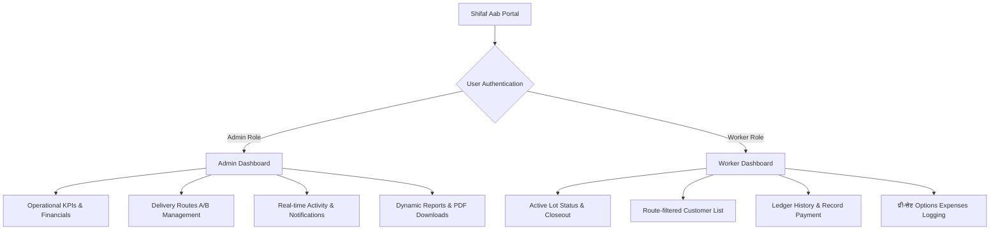

# Shifaf Aab — Final Application Documentation

Welcome to the master summary of **Shifaf Aab**, a role-based operations management application built for water delivery companies. This document provides a complete guide to the overall architecture, operational flows, and recent targeted enhancements.

---

## 🌟 1. Application Overview & Architecture

Shifaf Aab simplifies daily water delivery logistics, customer ledgers, payment tracking, and worker expenses. The application is divided into two distinct portals with custom dashboards and workflows based on user roles:

---

## 🚀 2. Core Functional Modules

### 👨‍🏭 A. The Worker Workflow

The worker portal is optimized for mobile-first usability during active delivery shifts:

1. **Lot Operations**:
   - Workers start a new delivery "lot" by specifying the number of bottles they are carrying.
   - During deliveries, workers log each customer transaction (bottles sold, unit price, and payment mode).
   - When their shift is complete, workers open the **Close Lot** confirmation screen, review their sales breakdown (total bottles sold, revenue collected, and pending amount), and confirm the lot closeout.

2. **Route-Filtered Customer List**:
   - Workers can instantly filter regular customers using top pill filters: **All Routes**, **Route A**, or **Route B**.
   - Each customer card displays a route badge, e.g. `Route A`, and two actions: **Log Delivery** and **Record Payment**.

3. **Ledger & Record Payment Access**:
   - Workers can tap a customer's card to inspect their complete ledger history, containing a **Deliveries** log and a **Payments** log.
   - Workers can record cash, card, or online payments directly. On submission:
     - The customer's balance updates instantly.
     - An activity notification is logged: `"Worker recorded payment of Rs. X from [Customer Name]"`.
     - Admin push notifications are triggered.

4. **Expenses Form**:
   - Workers can log daily expenses. The expense name is selected from a predefined list: **Option A, Option B, Option C, Option D, or Option E**, matching standard operational types and preventing free-text errors.

---

### 👑 B. The Admin Workflow

The admin portal provides high-level financial reporting and customer control:

1. **Dashboard & KPIs**:
   - **Total Revenue**: Sum of non-pending deliveries + payments collected.
   - **Net Revenue**: Total Revenue minus logged Expenses.
   - **Walk-in Revenue** & **Pending Collection**: Displayed as inline indicator chips.
   - **Customer Summary Table**: Lists regular customer dues. Negative balances are flagged as `"Overpaid"` in green badges.

2. **Customer & Route Settings**:
   - Admins can create new customers and assign them to **Route A** or **Route B** using selection pills.
   - Top route filter pills allow instant list filtering by delivery route.

3. **Operational Reports & PDFs**:
   - Admins can query operations on the **Bills** page using a calendar day picker, monthly presets (with a dynamic year dropdown selector), or custom range parameters.
   - Instantly generates and downloads high-quality PDF statements containing detailed sales breakdowns, expenses, payments, and per-customer ledger balances.

---

## 🛠️ 3. Summary of Recent Targeted Changes

The following updates were recently integrated and verified to compile with zero warnings or errors:

| Feature Module | Changes Made | Implementation Detail |
| :--- | :--- | :--- |
| **Worker Expenses** | **Predefined dropdown selector** | Replaced the free-text name field with a styled select box featuring options **Option A** through **Option E**. |
| **Worker Ledger** | **Customer payment & ledger logs** | Opened Ledger Drawer permissions to workers. Workers can now toggle ledger tabs, view dues, and record customer payments (Cash, Card, Online). |
| **Delivery Routes** | **Route A / B segmentation** | Added `route` check constraint column to customers. Added route filters, card badges, and ledger header route tags to both Worker and Admin views. |
| **Authentication** | **Registration Disabled** | Removed frontend "Create Account" sign-up links. Users must get credentials directly from the administration. |

---

## 🗄️ 4. Database Schema Migrations

The database structure is updated with the following migrations applied on Supabase:

1. **`20260628000000_add_push_subscription.sql`**: Configures VAPID push alerts subscriptions.
2. **`20260628000001_add_worker_id_notifications.sql`**: Connects operational notifications to `worker_id` uuid for worker activity tracking.
3. **`20260701000000_add_route_to_customers.sql`**: Adds the `route` text column to the `customers` table with constraint `CHECK (route IN ('A', 'B')) DEFAULT 'A'`.
